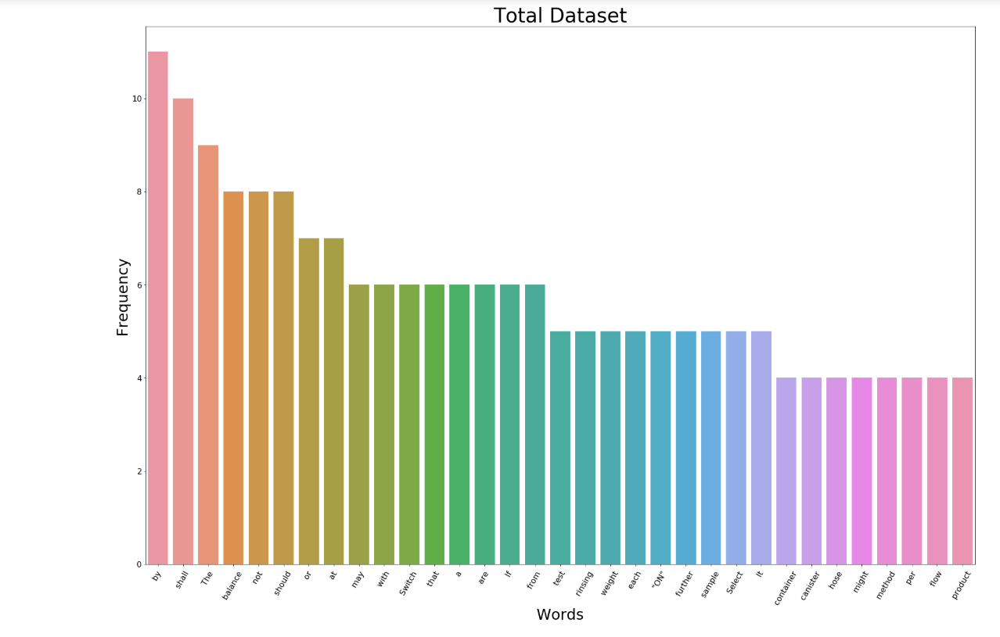
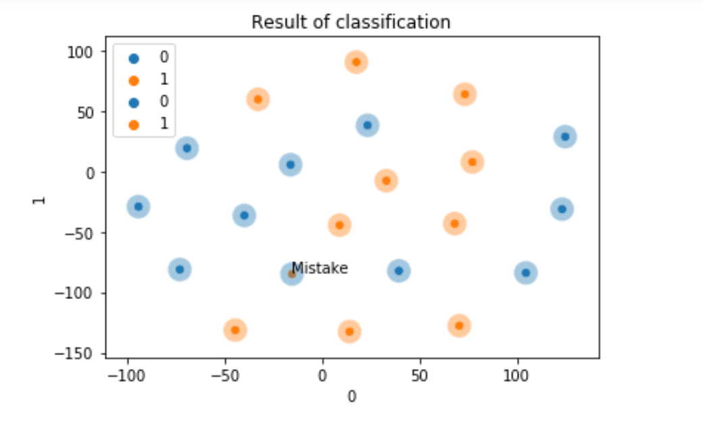

# DRL_Statement_Of_Procedure_Classification(SOP)

**The following repository contains the code to the classifier for action classifcation task**.
### Data Analysis
- A corpus of **2K sentences** labelled sentences consisting of valid and invalid SOPs collected from DRL web portal
used for SOP generation.

- It was partially cleaned by data collector.

- Dataset was unbalanced *random sampling* was used for balancing the dataset , has drawbacks.

### Text Feature Extraction

  Performed using *TF-IDF* measure with smoothing.
  
  Nature of dataset restricted me  applying techniques such as *Stemming,Normalization or StopWords removal*(requirement).
  The above cleaning techniques can be applied depending on the use case.
  
 
 ### Models Used
 
 **Note:Results may vary based on corpus size and type**
 
 All models were tuned on dev set and performed well on test set.
 
 
 - LSVM Linear Support Vector Machines 
 - MNB Multinomial Naive Bayes 
 - LR Logistic Regression
 
 **Visualizing SVM's learned weights** 
 
 .PNG)

### Classification Results

**~89% accuracy** was produced as a result of classification using SVM.

**PCA/TSNE** dimensionality reduction techniques were used to visualize results.

 
